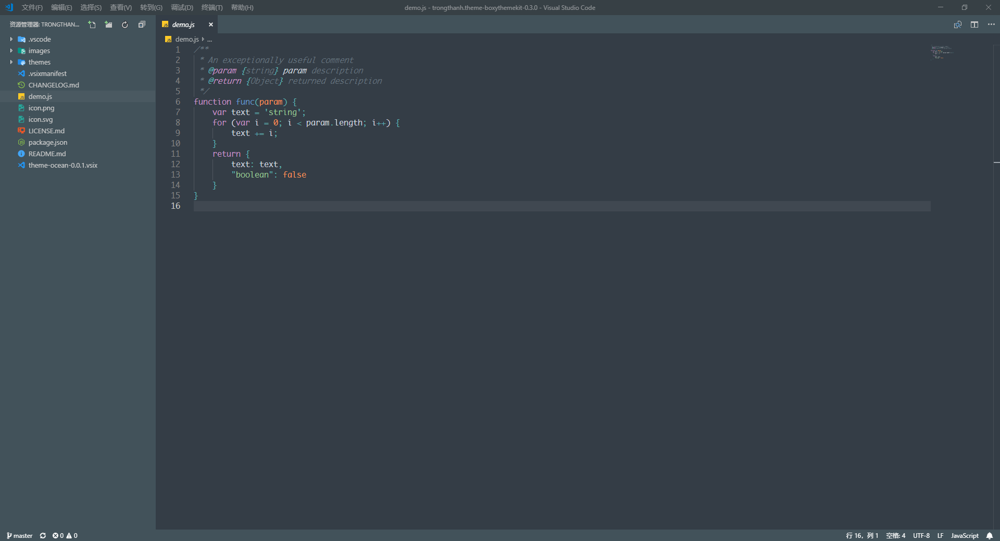
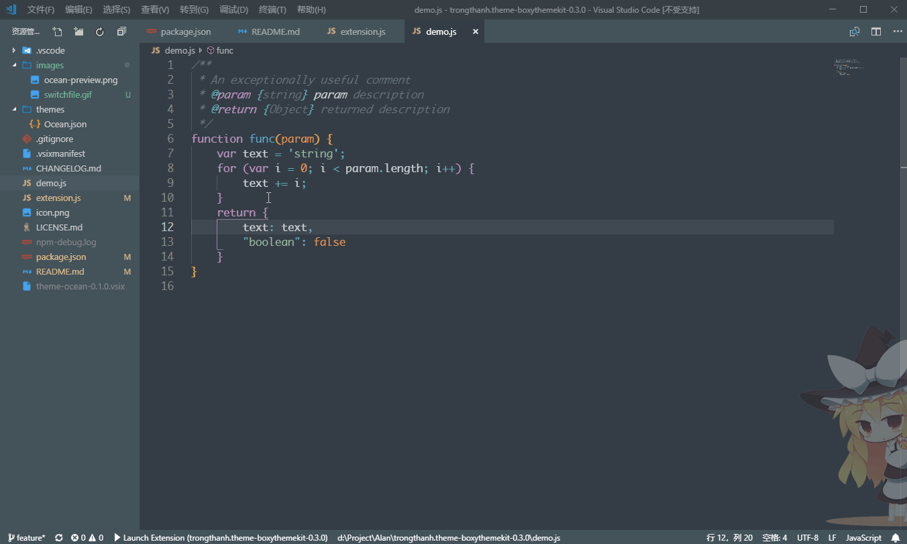
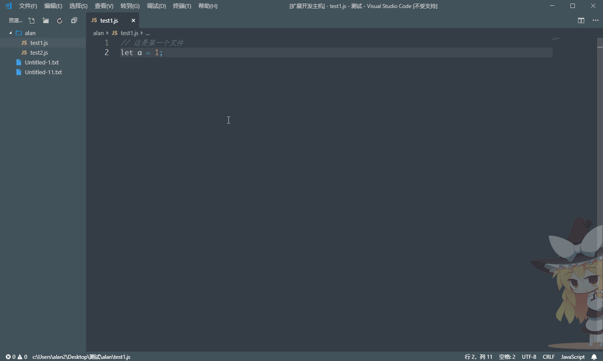

# vscode-theme-ocean
  

🎨 an ocean style theme of vscode

Vscode Market: https://marketplace.visualstudio.com/items?itemName=alanlang.theme-ocean#review-details

GitHub: https://github.com/AlanLang/vscode-theme-ocean
## 安装
1. 打开`vscode`插件管理
2. 搜索 `Ocean Theme`
3. 下载安装

## 小工具
* `shift+ctrl+l`: 快速插入log
* `shift+ctrl+d`: 删除该页所有的log
* `shift+ctrl+w`: 快速切换当前文件夹里面的其他文件
* `list todo`: 快速列出标有`TODO:`的代码行
* `commitizen commit`: 以`commitizen`的格式提交代码

## 效果展示

#### 主题效果

#### 快速添加log

#### 快速切换当前文件夹里面的其他文件

